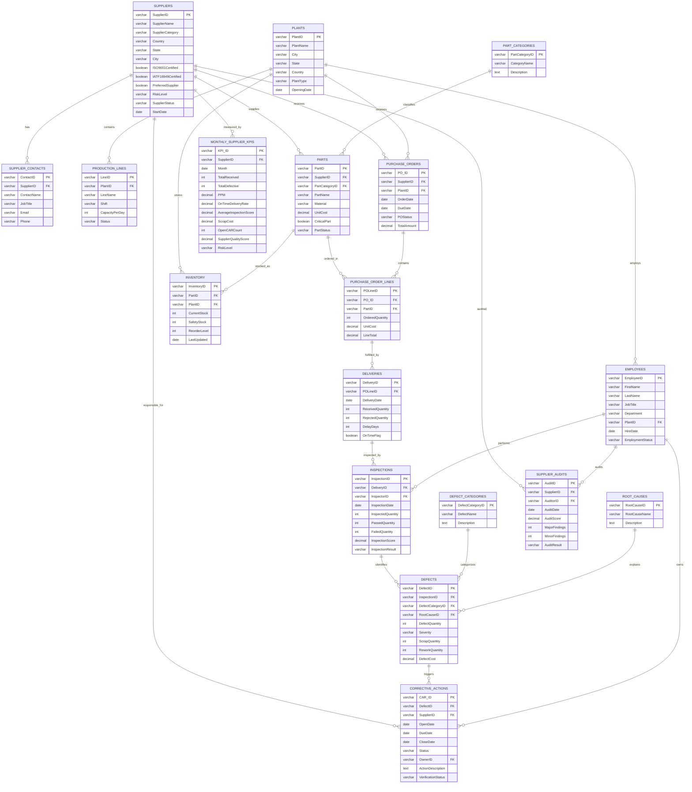

# ERD Design

## Manufacturing Supplier Intelligence Platform

---

# Purpose

This document defines the Entity Relationship Diagram (ERD) for the Manufacturing Supplier Intelligence Platform.

The ERD shows how supplier, part, purchasing, delivery, inspection, defect, corrective action, audit, inventory, and KPI data connect inside the database.

---

# Main Business Flow

```text
Supplier
   ↓
Part
   ↓
Purchase Order
   ↓
Purchase Order Line
   ↓
Delivery
   ↓
Inspection
   ↓
Defect
   ↓
Corrective Action
```

---

# Mermaid ERD



---

# Relationship Summary

| Parent Table       | Child Table         | Relationship                                       |
| ------------------ | ------------------- | -------------------------------------------------- |
| Suppliers          | SupplierContacts    | One supplier has many contacts                     |
| Suppliers          | Parts               | One supplier provides many parts                   |
| Suppliers          | PurchaseOrders      | One supplier receives many purchase orders         |
| Suppliers          | SupplierAudits      | One supplier has many audits                       |
| Suppliers          | CorrectiveActions   | One supplier may have many corrective actions      |
| Suppliers          | MonthlySupplierKPIs | One supplier has monthly KPI records               |
| Plants             | ProductionLines     | One plant has many production lines                |
| Plants             | Employees           | One plant has many employees                       |
| Plants             | PurchaseOrders      | One plant receives many purchase orders            |
| Plants             | Inventory           | One plant stores many inventory records            |
| PartCategories     | Parts               | One category contains many parts                   |
| Parts              | PurchaseOrderLines  | One part appears on many PO lines                  |
| Parts              | Inventory           | One part may exist in multiple inventory records   |
| PurchaseOrders     | PurchaseOrderLines  | One purchase order has many lines                  |
| PurchaseOrderLines | Deliveries          | One PO line may have many deliveries               |
| Deliveries         | Inspections         | One delivery may have many inspections             |
| Inspections        | Defects             | One inspection may identify many defects           |
| DefectCategories   | Defects             | One defect category appears in many defect records |
| RootCauses         | Defects             | One root cause appears in many defect records      |
| Defects            | CorrectiveActions   | One defect may trigger corrective actions          |
| Employees          | Inspections         | One employee may perform many inspections          |
| Employees          | SupplierAudits      | One employee may perform many audits               |
| Employees          | CorrectiveActions   | One employee may own many corrective actions       |

---

# Design Notes

* The design follows a normalized relational model.
* Operational records flow from purchase orders to inspections and defects.
* Supplier KPIs are stored separately in `MonthlySupplierKPIs` to support faster reporting.
* Corrective actions connect both supplier responsibility and defect history.
* Employees are used as inspectors, auditors, and corrective action owners.
* Inventory connects parts to plant-level stock levels.
